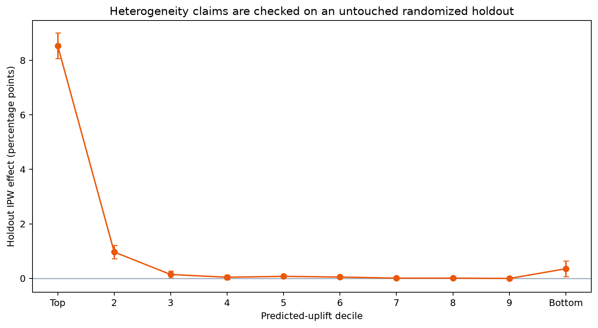

# Causal Experimentation Lab

[](https://github.com/nhatphan220506/causal-experimentation-lab/actions/workflows/ci.yml)

A decision-grade causal analysis of **13,979,592 observations from real randomized
incrementality trials**: assignment audit, intention-to-treat effects, exposure/IV
boundaries, cross-fitted adjustment, honest uplift evaluation, capacity policy and
a production experimentation-system design.

> **Status:** complete and reproducible. This project uses real randomized data;
> it does not claim that the repository itself ran in production.

**Start here:** [`CASE_STUDY.md`](CASE_STUDY.md) contains the full reasoning chain.
Open [`dashboard/index.html`](dashboard/index.html) for the reviewer dashboard.

## Decision question

Does treatment assignment create incremental visits and conversions—and when
treatment is costly or capacity-constrained, should it be deployed broadly or
targeted with an uplift policy?

## Executive answer

Treatment has a positive average causal effect under both pooled and adjusted
estimators. A holdout-validated uplift model identifies a much more responsive top
decile, but broad treatment creates greater total impact when treatment is free.

| Result | Estimate | Decision meaning |
|---|---:|---|
| Pooled visit ITT | **+1.034 pp** | +1,034 visits / 100k assigned |
| Pooled conversion ITT | **+0.115 pp** | +115 conversions / 100k assigned |
| Cross-fitted adjusted visit effect | **+0.728 pp** | direction survives adjustment |
| Cross-fitted adjusted conversion effect | **+0.096 pp** | downstream benefit survives adjustment |
| Top-decile holdout visit effect | **+5.79 pp** | strong option under 10% capacity |
| Top 10% efficiency | **+5,795 / 100k treated** | about 7.8× broad-policy efficiency |
| Broad-policy total impact | **+741 / 100k eligible** | greater total gain absent cost/harm |



## Why this is more than an A/B-test notebook

- Audits SRM, control contamination, missingness, outcome ordering and all
  pre-treatment covariates before reading lift.
- Preserves assignment as the causal estimand and rejects exposed/unexposed
  comparison as post-treatment selection.
- Reports pooled ITT beside cross-fitted doubly robust sensitivity estimates.
- Discovers and fixes treatment-block row ordering before model training.
- Trains on 3M rows and evaluates targeting on a disjoint 3M randomized holdout.
- Separates observed-outcome AUC from causal ranking quality.
- Evaluates the policy with propensity-weighted holdout outcomes and uncertainty.
- Distinguishes efficiency per treated unit from total impact per eligible unit.
- Leaves ROI unresolved until real cost, value, capacity and harm inputs exist.
- Specifies production assignment, exposure, metric, trust, ramp and rollback
  contracts without pretending offline analysis is production ownership.

## Evidence map

- [`reports/01_data_audit.md`](reports/01_data_audit.md): provenance, SRM,
  contamination, balance and the row-order incident.
- [`reports/02_average_treatment_effects.md`](reports/02_average_treatment_effects.md):
  pooled ITT, power, adjusted sensitivity and exposure boundaries.
- [`reports/03_uplift_and_policy.md`](reports/03_uplift_and_policy.md): honest
  heterogeneous-effect evaluation and capacity frontier.
- [`reports/04_decision_memo.md`](reports/04_decision_memo.md): action by operating
  constraint, rollout contract and reversal conditions.
- [`docs/experiment_charter.md`](docs/experiment_charter.md): frozen estimands,
  non-estimands, trust checks and thresholds.
- [`docs/research_synthesis.md`](docs/research_synthesis.md): how causal and
  experimentation research changed the implementation.
- [`docs/experiment_platform_design.md`](docs/experiment_platform_design.md):
  assignment service, telemetry, metric layer, trust gates, ramp and rollback.
- [`docs/limitations.md`](docs/limitations.md): ten explicit claim boundaries.

## Analytical flow

```text
official corrected source
        ↓
schema + assignment + balance audit
        ↓
full-data pooled ITT ────── cross-fitted adjusted sensitivity
        ↓                                  ↓
assignment/exposure boundary       honest train/holdout split
                                           ↓
                               uplift ranking + IPW policy value
                                           ↓
                         efficiency vs total-impact frontier
                                           ↓
                              conditional rollout decision
```

## Reproduce

Python 3.11+ is required. Raw and prepared datasets are intentionally ignored by
Git; generated compact results and figures are committed for review.

```bash
python -m venv .venv
source .venv/bin/activate
pip install -e ".[dev]"
make all
```

`make all` downloads the official 311 MB gzip file, verifies its size, prepares a
Parquet copy, scans the full 13.98M rows for audit and ITT, fits/evaluates the 6M-row
policy workflow, rebuilds figures/dashboard, and runs tests. Individual stages are
available as `make audit`, `make ate`, `make uplift`, `make figures`, and `make test`.

## Repository map

```text
src/
  audit.py                 full-data assignment and balance checks
  estimate_ate.py          pooled ITT, confidence intervals and MDE
  uplift_policy.py         honest T-learner, propensity, DR and policy frontier
  build_figures.py         publication-ready evidence charts
  build_dashboard.py       self-contained reviewer dashboard
docs/                      estimand, research, platform and decision contracts
reports/                   evidence-led readouts and generated compact results
tests/                     statistical invariants and failure detection
dashboard/index.html       portfolio-facing summary
```

## Data source

The project uses the corrected **Criteo Uplift Prediction Dataset v2.1**, built from
several randomized advertising incrementality tests. The official page explains
the prior-release leakage and publishes the corrected file.

- Official dataset card: https://ailab.criteo.com/criteo-uplift-prediction-dataset/
- Large-scale benchmark paper: https://arxiv.org/abs/2111.10106

Dataset contents are not redistributed by this repository. See the provider's
terms before using the data beyond research and portfolio analysis.

## Honest limitations

The data are advertising—not a product checkout test—and have anonymised features,
no trial/user/time IDs, no treatment cost, no monetary value and no customer-harm
metrics. Trial-level transport, retention, delayed outcomes, interference and ROI
cannot be recovered. The uplift ranking is validated on a holdout from the same
source and still requires independent replication.

