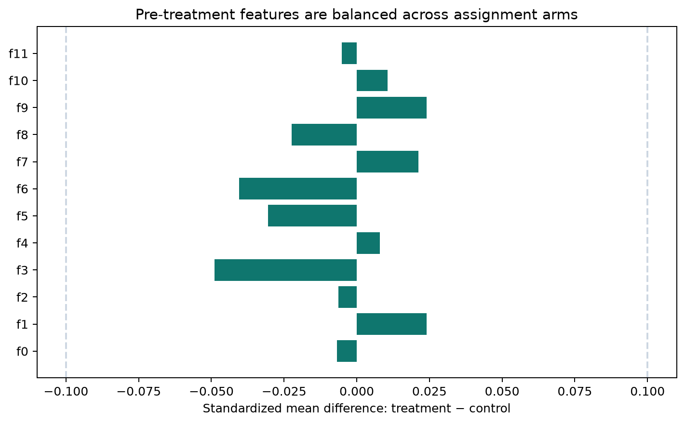

# 01 — Data and randomisation audit

## Verdict

The corrected v2.1 file is structurally complete and the aggregate assignment
count matches the published 85/15 allocation. The data are suitable for an ITT
readout, with an important caveat: the pooled source represents several trials and
does not expose experiment IDs.

## Reconciled population

| Check | Result | Interpretation |
|---|---:|---|
| Observations | 13,979,592 | matches the official corrected release |
| Treatment | 11,882,655 | 85.000013% |
| Control | 2,096,937 | 14.999987% |
| SRM p-value vs 85/15 | 0.9989 | no aggregate count mismatch |
| Missing feature values | 0 | complete across `f0`–`f11` |
| Control rows marked exposed | 0 | no observed control contamination |
| Conversion without visit | 0 | logical outcome nesting holds |

## Covariate balance

All 12 standardised mean differences are below 0.05 in absolute value. The
largest is `f3` at −0.0488. This is below the conventional 0.10 practical flag,
but it is not ignored: at this scale, nonlinear predictive imbalance can move an
adjusted estimate even when marginal SMDs look small.

## Data-order incident discovered during modelling

The source file is not randomly ordered. Early blocks contain treatment rows only.
An initial implementation that took the first 1.5 million rows therefore produced
a single-arm training sample and failed before fitting.

The corrected pipeline:

1. adds a stable `row_id` during source-to-Parquet conversion;
2. creates disjoint train/holdout pools with `hash(row_id) % 2`;
3. samples treatment and control separately inside each pool;
4. fixes the 85/15 arm ratio in both samples;
5. evaluates every targeting claim only on the untouched pool.

This incident is retained in the case study because silent row-order dependence is
a realistic source of misleading ML results.

## Claim boundary

SRM checks only aggregate allocation. Because trial identifiers and exact
trial-specific propensities are absent, the audit cannot prove balance within every
underlying experiment. Both unadjusted pooled ITT and cross-fitted covariate-
adjusted sensitivity estimates are therefore reported.

