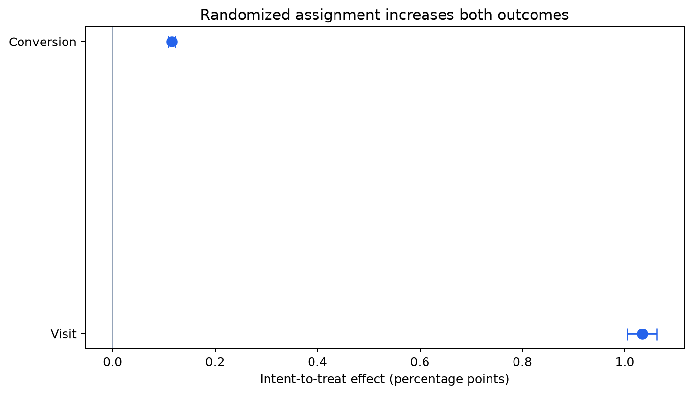

# 02 — Average treatment effects

## Unadjusted pooled ITT

| Outcome | Control | Treatment | Absolute ITT | 95% CI | Relative lift | Per 100k assigned |
|---|---:|---:|---:|---:|---:|---:|
| Visit | 3.8201% | 4.8543% | +1.0342 pp | +1.0056 to +1.0629 pp | +27.07% | +1,034 |
| Conversion | 0.1938% | 0.3089% | +0.1152 pp | +0.1085 to +0.1219 pp | +59.45% | +115 |

The achieved 80%-power MDE is approximately 0.0402 percentage points for visit
and 0.0092 points for conversion under a two-sided 5% test. The study is therefore
precise enough to detect effects far smaller than the observed estimates.

## Holdout reconciliation and adjusted sensitivity

The raw difference on a disjoint 3 million-row holdout is **+1.0163 pp** for visits
and **+0.1166 pp** for conversion. Those estimates reconcile with the full-sample
ITT, so the train/holdout sampler is not the source of the earlier discrepancy.

Separate outcome models are trained on 3 million observations. A doubly robust
score is evaluated on the holdout using the known 85/15 assignment probability.
A learned propensity model is retained only as a diagnostic.

| Outcome | Cross-fitted DR effect | Approx. 95% CI |
|---|---:|---:|
| Visit | +0.7223 pp | +0.6707 to +0.7738 pp |
| Conversion | +0.0969 pp | +0.0833 to +0.1104 pp |

The diagnostic propensity model has AUC 0.510, with predicted assignment probability
from 0.844 at p01 to 0.896 at p99. Using it instead changes the visit DR estimate only
slightly, to +0.7282 pp. The unresolved gap is therefore caused by outcome-model
adjustment and covariate structure, not by the learned propensity alone.

In a simple individually randomized trial these estimates should be much closer.
The source pools several experiments but exposes no trial identifiers or assignment
strata, so the gap cannot be adjudicated from the file. The primary descriptive causal
readout remains assignment-based ITT; the exact magnitude and targeting policy are
not promoted until the randomization mechanism can be reconstructed.

## Assignment versus exposure

Only 3.604% of assigned treatment observations are marked exposed, versus zero in
control. Dividing ITT by this first stage yields Wald estimates of +28.7 pp for
visit and +3.20 pp for conversion among hypothetical compliers.

Those large values are **not** the headline result. They require exclusion,
monotonicity, correct exposure measurement, and a meaningful complier population.
The source does not let us validate those assumptions. A direct exposed/unexposed
comparison is omitted because exposure is post-treatment selection.

## Decision interpretation

- Direction is robust: all estimators remain positive.
- Magnitude is method-sensitive: +0.72 pp adjusted versus +1.02–1.03 pp raw.
- The estimator gap is a failed reconciliation check, not evidence that one decimal
  is universally correct.
- Economic viability still requires treatment cost and outcome value.
- Statistical certainty does not establish transport to a new company or channel.
