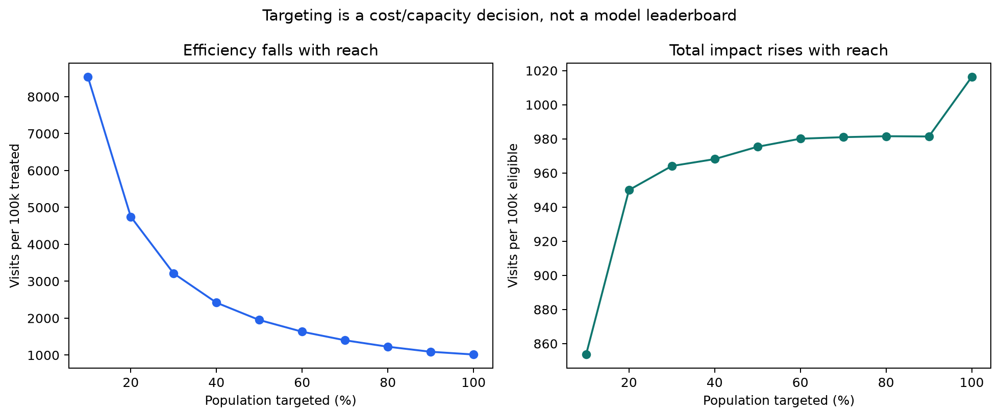

# 03 — Heterogeneous effects and policy value

## Question

If capacity or treatment cost prevents broad deployment, can pre-treatment
features identify a population with greater incremental response?

## Honest evaluation design

- 3,000,000 rows train treatment and control outcome models.
- A disjoint 3,000,000-row randomized holdout evaluates every claim.
- A visit T-learner predicts `P(Y=1|X,Z=1) − P(Y=1|X,Z=0)`.
- The known 85/15 randomization probability supports primary IPW and doubly robust
  checks; a separately trained propensity model is diagnostic only.
- Decile effects are observed holdout IPW estimates, not model predictions.
- Visit was fixed as the ranking outcome before evaluation; sparse conversion is
  retained as a broad business outcome, not mined across deciles.

The observed-outcome AUC is 0.946. This measures risk prediction, not causal
ranking. The correlation between predicted uplift and the noisy transformed
outcome is only 0.038; high AUC is therefore never presented as proof of uplift.

## Holdout result

The top predicted decile has a holdout IPW visit effect of **+8.53 percentage
points** (approximate 95% CI +8.06 to +9.01). The second decile is +0.97 points;
most remaining deciles are close to zero.

The most important failure mode is at the bottom: the model predicts **−0.74 pp**
mean uplift, while randomized holdout outcomes estimate **+0.35 pp** (approximate
95% CI +0.07 to +0.64). The model therefore does **not** identify a harmed subgroup.
It may prioritize opportunity, but it must not be used to suppress treatment on an
individual-harm claim.

## Capacity frontier

| Target share | Visit effect among targeted | Visits / 100k targeted | Visits / 100k eligible |
|---:|---:|---:|---:|
| 10% | +8.54 pp | +8,536 | +854 |
| 20% | +4.75 pp | +4,750 | +950 |
| 50% | +1.95 pp | +1,951 | +975 |
| 100% | +1.02 pp | +1,016 | +1,016 |

Targeting the top 10% is roughly 8.4× as efficient per treatment as treating
everyone, but broad treatment produces more total incremental visits in the
eligible population. Therefore:

- with a hard 10% capacity limit, use the top-decile policy;
- with material per-treatment cost, choose the point whose lower-bound value
  exceeds cost;
- with negligible cost and no harm, broad assignment maximises total impact;
- do not deploy the model until ranking replicates in a second trial or period and
  the raw-versus-adjusted ATE gap is resolved from trial-level assignment metadata.

## Why this is not a persona exercise

Features are anonymised. Naming the top decile “high intent”, “premium”, or any
other behavioural segment would be invented. The output is a validated ranking
policy; product interpretation requires a dataset with semantic features and user
research.
